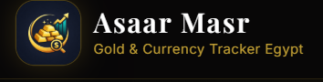

# Asaar Masr (أسعار مصر) - Gold Price Tracking & E-Commerce Platform

<div align="center">



**A Modern Gold Trading Platform with Egyptian Heritage**

[](https://reactjs.org/)
[](https://www.typescriptlang.org/)
[](https://vitejs.dev/)
[](https://tailwindcss.com/)
[](https://nodejs.org/)
[](https://www.mongodb.com/)

</div>

---

## 🚀 Live Demo & Submission Links

| Link | URL |
|------|-----|
| **Live Website** | https://asaarmasr.vercel.app |
| **GitHub Repo** | https://github.com/saperaa/Asaarmasr |
| **Demo Video** | *(see submission)* |

> **Note:** The public gold price tracking, calculator, and charts work fully on the live site (powered by the external gold price API). The CRM admin system, blog management, and store management require running the backend locally — see [Installation & Setup](#installation--setup).

---

## 📋 Table of Contents

1. [Executive Summary](#executive-summary)
2. [Project Overview](#project-overview)
3. [Key Features](#key-features)
4. [System Architecture](#system-architecture)
5. [Technology Stack](#technology-stack)
6. [Project Structure](#project-structure)
7. [Installation & Setup](#installation--setup)
8. [API Documentation](#api-documentation)
9. [Database Schema](#database-schema)
10. [Screenshots & UI](#screenshots--ui)
11. [Future Enhancements](#future-enhancements)
12. [Team & Credits](#team--credits)

---

## 🎯 Executive Summary

**Asaar Masr** is a comprehensive gold price tracking and e-commerce platform designed specifically for the Egyptian market. The platform combines real-time gold price monitoring with a full-featured e-commerce system, all wrapped in a distinctive Egyptian pharaonic aesthetic.

The project demonstrates:
- **Full-stack development** with modern technologies
- **Real-time data integration** from external APIs
- **3D web graphics** using Three.js
- **Bilingual support** (English/Arabic) with RTL layouts
- **Role-based access control** for admin operations
- **Responsive design** with luxury UI/UX

---

## 🏛️ Project Overview

### Purpose
Provide Egyptians with a reliable, beautiful platform to:
- Track live gold prices (24K, 21K, 18K, gold pound)
- Access historical price charts and trends
- Calculate gold values and make informed decisions
- Purchase gold products online
- Find nearby physical gold stores
- Learn about gold investment through educational content

### Target Users
1. **General Public** - People tracking gold prices for investment or purchase
2. **Gold Traders** - Professionals monitoring market trends
3. **Store Owners** - Businesses listing their products and locations
4. **Administrators** - Staff managing orders, products, and content

### Unique Value Proposition
- **Cultural Identity**: Egyptian pharaonic theme with 3D Tutankhamun mask
- **Real-time Data**: Live gold prices updated every 12 seconds
- **All-in-One Solution**: Price tracking + e-commerce + store locator
- **Mobile-First**: Optimized for all devices with luxury aesthetics

---

## ✨ Key Features

### 🔮 Public Website Features

#### 1. 3D Hero Section
- Interactive **Tutankhamun mask** rendered with Three.js
- Cinematic scroll-triggered animations
- Egyptian hieroglyphic decorations
- Fully responsive 3D experience

#### 2. Live Gold Price Dashboard
| Feature | Description |
|---------|-------------|
| Real-time Updates | Prices refresh every 12 seconds |
| Multiple Karats | 24K, 21K, 18K, and gold pound prices |
| Price Changes | Visual indicators for daily price movement |
| Currency Support | Egyptian Pound (EGP) with USD conversion |

#### 3. Interactive Price Charts
- Historical price visualization using **Recharts**
- Time range selection (Day, Week, Month, Year)
- Multiple karat comparison
- Responsive chart design

#### 4. Gold Calculator
- Calculate gold value by weight and karat
- Real-time price integration
- Support for multiple units (gram, ounce)
- Instant value calculation

#### 5. Store Locator
- Interactive map of gold stores in Cairo & Alexandria
- Store details (hours, contact, services)
- Filter by location and services
- Directions integration

#### 6. Blog System
- Educational articles about gold investment
- Categories and tags
- Related articles
- SEO-optimized content

#### 7. E-Commerce
- Product catalog with filters
- Shopping cart functionality
- Secure checkout process
- Order tracking

#### 8. Additional Features
- **FAQ Section** - Common questions about gold buying
- **Currency Exchange** - USD/EGP rates with Sagha market rates
- **Newsletter** - Price alerts and updates
- **Bilingual Support** - Full Arabic and English support with RTL

---

### 🎛️ CRM/Admin System Features

#### Authentication & Authorization
- JWT-based secure authentication
- Role-based access (Admin, Shipper)
- Protected routes and API endpoints

#### Dashboard
- Order statistics and KPIs
- Recent orders overview
- Revenue charts
- Quick action buttons

#### Order Management
- View all orders with filtering
- Update order status (Pending → Processing → Shipped → Delivered)
- Order details with customer info
- Shipping tracking

#### Product Management
- Add/edit/delete products
- Bilingual product names (EN/AR)
- Image upload and management
- Inventory tracking
- Category management

#### Store Management
- Add/edit physical store locations
- Store hours and contact info
- Service offerings
- Map coordinates

#### User Management
- Manage CRM users (admins, shippers)
- Role assignment
- Account activation/deactivation

#### Blog Management
- Create and edit blog posts
- Rich text editing
- Featured images
- Publishing workflow

#### Alternative Admin Interface
- **AdminJS** panel at `/admin` for quick data management

---

## 🏗️ System Architecture

```
┌─────────────────────────────────────────────────────────────────┐
│                        CLIENT LAYER                              │
│  ┌──────────────┐  ┌──────────────┐  ┌──────────────────────┐  │
│  │   Browser    │  │   Browser    │  │      Browser         │  │
│  │  (React App) │  │  (React App) │  │    (Mobile/Tablet)   │  │
│  └──────────────┘  └──────────────┘  └──────────────────────┘  │
└─────────────────────────────────────────────────────────────────┘
                              │
                              ▼ HTTP/HTTPS
┌─────────────────────────────────────────────────────────────────┐
│                      PRESENTATION LAYER                          │
│                    (Vite + React + TS)                           │
│  ┌─────────────┐  ┌─────────────┐  ┌─────────────────────────┐  │
│  │  React Router│  │   Context   │  │    Custom Hooks         │  │
│  │   (Routes)   │  │  (State)    │  │  (useGoldApi, etc.)     │  │
│  └─────────────┘  └─────────────┘  └─────────────────────────┘  │
│  ┌─────────────┐  ┌─────────────┐  ┌─────────────────────────┐  │
│  │  Components │  │    Pages    │  │      3D (Three.js)      │  │
│  │ (shadcn/ui) │  │ (Routes)    │  │   (Tutankhamun Mask)    │  │
│  └─────────────┘  └─────────────┘  └─────────────────────────┘  │
└─────────────────────────────────────────────────────────────────┘
                              │
                              ▼ REST API
┌─────────────────────────────────────────────────────────────────┐
│                       API LAYER                                  │
│                 (Node.js + Express)                              │
│  ┌─────────────┐  ┌─────────────┐  ┌─────────────────────────┐  │
│  │   Routes    │  │ Middleware  │  │     Controllers         │  │
│  │  (/api/*)   │  │  (Auth/JWT) │  │   (Business Logic)      │  │
│  └─────────────┘  └─────────────┘  └─────────────────────────┘  │
│  ┌─────────────────────────────────────────────────────────────┐│
│  │                    AdminJS Panel (/admin)                    ││
│  └─────────────────────────────────────────────────────────────┘│
└─────────────────────────────────────────────────────────────────┘
                              │
                              ▼ Mongoose ODM
┌─────────────────────────────────────────────────────────────────┐
│                      DATA LAYER                                  │
│                     (MongoDB)                                    │
│  ┌─────────────┐  ┌─────────────┐  ┌─────────────────────────┐  │
│  │   Users     │  │   Orders    │  │       Products          │  │
│  │  (CrmUser)  │  │   (Order)   │  │      (Product)          │  │
│  └─────────────┘  └─────────────┘  └─────────────────────────┘  │
│  ┌─────────────┐  ┌─────────────┐  ┌─────────────────────────┐  │
│  │   Stores    │  │  BlogPosts  │  │      Customers          │  │
│  │   (Store)   │  │  (BlogPost) │  │     (Customer)          │  │
│  └─────────────┘  └─────────────┘  └─────────────────────────┘  │
└─────────────────────────────────────────────────────────────────┘
                              │
                              ▼ External API
┌─────────────────────────────────────────────────────────────────┐
│                   EXTERNAL SERVICES                              │
│              (asaarmasr.info/api/v1/gold)                        │
└─────────────────────────────────────────────────────────────────┘
```

---

## 💻 Technology Stack

### Frontend

| Technology | Version | Purpose |
|------------|---------|---------|
| **React** | 18.3.1 | UI library with hooks and context |
| **TypeScript** | 5.4 | Type safety and developer experience |
| **Vite** | 6.3.5 | Fast build tool and dev server |
| **Tailwind CSS** | 4.1.12 | Utility-first styling |
| **React Router** | 7.13.0 | Client-side routing |
| **Three.js** | 0.173.0 | 3D graphics rendering |
| **Framer Motion** | 12.23.24 | Smooth animations |
| **Recharts** | 2.x | Data visualization |
| **shadcn/ui** | latest | Accessible UI components |
| **Lucide React** | 0.x | Icon library |

### Backend

| Technology | Version | Purpose |
|------------|---------|---------|
| **Node.js** | 18+ | JavaScript runtime |
| **Express** | 4.18.3 | Web framework |
| **MongoDB** | 5.0+ | NoSQL database |
| **Mongoose** | 9.6.1 | MongoDB ODM |
| **AdminJS** | 7.8.17 | Admin panel framework |
| **JWT** | 9.0.2 | Authentication tokens |
| **bcryptjs** | 2.4.3 | Password hashing |
| **CORS** | 2.8.5 | Cross-origin requests |

### Development Tools

| Tool | Purpose |
|------|---------|
| **ESLint** | Code linting |
| **PostCSS** | CSS processing |
| **Git** | Version control |
| **Vercel** | Deployment platform |
| **Draco** | 3D model compression |

---

## 📁 Project Structure

```
Asaarmasr/
├── 📄 index.html                    # HTML entry point
├── 📄 package.json                  # Frontend dependencies
├── 📄 tsconfig.json                 # TypeScript configuration
├── 📄 vite.config.ts                # Vite build configuration
├── 📄 vercel.json                   # Vercel deployment config
├── 📄 README.md                     # Project documentation
├── 📄 ATTRIBUTIONS.md               # License credits
│
├── 📁 src/                          # Frontend source code
│   ├── 📄 main.tsx                  # React application entry
│   │
│   ├── 📁 styles/                   # Stylesheets
│   │   ├── 📄 index.css             # Global styles
│   │   ├── 📄 theme.css             # CSS variables & theming
│   │   ├── 📄 tailwind.css          # Tailwind directives
│   │   └── 📄 fonts.css             # Font imports
│   │
│   └── 📁 app/                      # Main application
│       ├── 📄 App.tsx               # Root component & routing
│       │
│       ├── 📁 components/           # React components
│       │   ├── 📁 ui/               # 47+ shadcn/ui components
│       │   ├── 📄 header.tsx        # Navigation header
│       │   ├── 📄 footer.tsx        # Page footer
│       │   ├── 📄 cinematic-hero-3d.tsx    # 3D hero section
│       │   ├── 📄 price-card.tsx    # Gold price cards
│       │   ├── 📄 price-table.tsx   # Detailed price table
│       │   ├── 📄 price-chart.tsx   # Historical charts
│       │   ├── 📄 gold-calculator.tsx      # Value calculator
│       │   ├── 📄 blog-posts.tsx    # Blog section
│       │   ├── 📄 stores-section.tsx       # Store locator
│       │   ├── 📄 currency-exchange.tsx    # FX rates
│       │   ├── 📄 faq-section.tsx   # FAQ accordion
│       │   └── 📄 egyptian-glyphs.tsx      # Decorative elements
│       │
│       ├── 📁 pages/                # Route pages
│       │   ├── 📄 BlogArticlePage.tsx
│       │   ├── 📄 BlogListPage.tsx
│       │   ├── 📄 BuyGoldPage.tsx
│       │   └── 📁 crm/              # CRM admin pages
│       │       ├── 📄 CrmLoginPage.tsx
│       │       ├── 📄 CrmDashboardPage.tsx
│       │       ├── 📄 CrmOrdersPage.tsx
│       │       ├── 📄 CrmProductsPage.tsx
│       │       ├── 📄 CrmStoresPage.tsx
│       │       ├── 📄 CrmUsersPage.tsx
│       │       ├── 📄 CrmBlogPage.tsx
│       │       └── 📄 CrmLayout.tsx
│       │
│       ├── 📁 context/              # React contexts
│       │   ├── 📄 auth-context.tsx         # Authentication
│       │   ├── 📄 crm-context.tsx          # CRM data
│       │   └── 📄 language-context.tsx     # i18n (EN/AR)
│       │
│       └── 📁 hooks/                # Custom hooks
│           ├── 📄 use-gold-api.ts          # Gold price API
│           ├── 📄 use-luxury-parallax.ts
│           └── 📄 use-nav-active-section.ts
│
├── 📁 backend/                      # Node.js backend
│   ├── 📄 package.json              # Backend dependencies
│   └── 📁 src/
│       ├── 📄 server.js             # Express server entry
│       ├── 📄 admin-server.mjs      # AdminJS server
│       ├── 📄 db.js                 # MongoDB connection
│       ├── 📁 middleware/
│       │   └── 📄 auth.js           # JWT authentication
│       ├── 📁 models/               # Mongoose models
│       │   ├── 📄 BlogPost.js
│       │   ├── 📄 CrmUser.js
│       │   ├── 📄 Customer.js
│       │   ├── 📄 Order.js
│       │   ├── 📄 Product.js
│       │   └── 📄 Store.js
│       └── 📁 routes/               # API routes
│           ├── 📄 auth.js
│           ├── 📄 blog.js
│           ├── 📄 customer-auth.js
│           ├── 📄 orders.js
│           ├── 📄 products.js
│           ├── 📄 public.js
│           ├── 📄 stores.js
│           └── 📄 users.js
│
├── 📁 public/                       # Static assets
│   ├── 📄 favicon.png
│   ├── 📄 gold.png
│   ├── 📄 pharaonic-pattern.png
│   ├── 📄 asaar-brand-mark.png
│   ├── 📄 tutankhamun-mask.jpg
│   ├── 📁 draco/                    # Draco 3D compression
│   └── 📁 models/                   # 3D models
│       └── 📄 tutankhamun-mask.glb  # 8MB 3D mask model
│
└── 📁 guidelines/                   # AI coding guidelines
    └── 📄 Guidelines.md
```

---

## 🚀 Installation & Setup

### Prerequisites
- Node.js (v18 or higher)
- MongoDB (v5.0 or higher)
- npm or yarn
- Git

### 1. Clone the Repository

```bash
git clone <repository-url>
cd Asaarmasr
```

### 2. Frontend Setup

```bash
# Install dependencies
npm install

# Start development server
npm run dev

# Build for production
npm run build
```

The frontend will run on `http://localhost:5173`

### 3. Backend Setup

```bash
# Navigate to backend directory
cd backend

# Install dependencies
npm install

# Create environment file
cp .env.example .env

# Edit .env with your MongoDB URI
MONGODB_URI=mongodb://localhost:27017/asaarmasr
JWT_SECRET=your-secret-key
PORT=3001

# Start the server
npm start
```

The backend API will run on `http://localhost:3001`

### 4. AdminJS Setup (Optional)

```bash
# In backend directory
node src/admin-server.mjs
```

Admin panel available at `http://localhost:3000/admin`

### 5. Environment Variables

#### Frontend (.env)
```
VITE_API_URL=http://localhost:3001/api
```

#### Backend (.env)
```
PORT=3001
MONGODB_URI=mongodb://localhost:27017/asaarmasr
JWT_SECRET=your-super-secret-jwt-key
JWT_EXPIRE=7d
NODE_ENV=development
```

---

## 📡 API Documentation

### Base URL
```
http://localhost:3001/api
```

### Authentication Endpoints

| Method | Endpoint | Description |
|--------|----------|-------------|
| POST | `/auth/login` | Admin/CRM login |
| POST | `/auth/register` | Register new admin (protected) |
| GET | `/auth/me` | Get current user |

### Public Endpoints

| Method | Endpoint | Description |
|--------|----------|-------------|
| GET | `/public/gold-prices` | Get current gold prices |
| GET | `/public/currency-rates` | Get USD/EGP rates |
| GET | `/public/stores` | List all stores |
| GET | `/public/products` | List available products |

### Orders Endpoints (Protected)

| Method | Endpoint | Description |
|--------|----------|-------------|
| GET | `/orders` | List all orders |
| POST | `/orders` | Create new order |
| GET | `/orders/:id` | Get order details |
| PUT | `/orders/:id` | Update order status |
| DELETE | `/orders/:id` | Delete order |

### Products Endpoints (Protected)

| Method | Endpoint | Description |
|--------|----------|-------------|
| GET | `/products` | List all products |
| POST | `/products` | Create new product |
| GET | `/products/:id` | Get product details |
| PUT | `/products/:id` | Update product |
| DELETE | `/products/:id` | Delete product |

### Blog Endpoints

| Method | Endpoint | Description |
|--------|----------|-------------|
| GET | `/blog` | List all blog posts |
| GET | `/blog/:slug` | Get single post |
| POST | `/blog` | Create post (protected) |
| PUT | `/blog/:id` | Update post (protected) |
| DELETE | `/blog/:id` | Delete post (protected) |

### Response Format

All API responses follow this structure:

```json
{
  "success": true,
  "data": { ... },
  "message": "Operation successful"
}
```

Error responses:

```json
{
  "success": false,
  "error": "Error message",
  "code": 400
}
```

---

## 🗄️ Database Schema

### CrmUser (Admin & Shipper Accounts)
```javascript
{
  _id: ObjectId,
  name: String,           // Full name
  email: String,          // Unique email
  password: String,       // Hashed password
  role: String,           // 'admin' | 'shipper'
  isActive: Boolean,      // Account status
  createdAt: Date,
  updatedAt: Date
}
```

### Customer
```javascript
{
  _id: ObjectId,
  name: String,
  email: String,
  phone: String,
  address: {
    street: String,
    city: String,
    governorate: String
  },
  createdAt: Date
}
```

### Product
```javascript
{
  _id: ObjectId,
  nameEn: String,         // English name
  nameAr: String,         // Arabic name
  descriptionEn: String,
  descriptionAr: String,
  category: String,       // 'bars' | 'coins' | 'jewelry'
  karat: Number,          // 24 | 21 | 18
  weight: Number,         // in grams
  price: Number,          // in EGP
  images: [String],       // Image URLs
  inStock: Boolean,
  featured: Boolean,
  createdAt: Date
}
```

### Order
```javascript
{
  _id: ObjectId,
  orderNumber: String,    // Unique order ID
  customer: ObjectId,     // Reference to Customer
  items: [{
    product: ObjectId,
    quantity: Number,
    price: Number
  }],
  totalAmount: Number,
  status: String,         // 'pending' | 'processing' | 'shipped' | 'delivered'
  shippingAddress: {
    street: String,
    city: String,
    governorate: String,
    phone: String
  },
  paymentMethod: String,
  notes: String,
  createdAt: Date,
  updatedAt: Date
}
```

### Store
```javascript
{
  _id: ObjectId,
  nameEn: String,
  nameAr: String,
  address: String,
  city: String,           // 'Cairo' | 'Alexandria' | etc.
  phone: String,
  hours: {
    open: String,
    close: String
  },
  services: [String],     // ['buy', 'sell', 'exchange']
  location: {
    lat: Number,
    lng: Number
  },
  isActive: Boolean
}
```

### BlogPost
```javascript
{
  _id: ObjectId,
  titleEn: String,
  titleAr: String,
  slug: String,           // URL-friendly identifier
  contentEn: String,
  contentAr: String,
  excerptEn: String,
  excerptAr: String,
  featuredImage: String,
  category: String,
  tags: [String],
  author: ObjectId,
  published: Boolean,
  publishedAt: Date,
  views: Number,
  createdAt: Date
}
```

---

## 📱 Screenshots & UI

### Public Website

#### Home Page - 3D Hero Section
- Immersive Tutankhamun mask with cinematic scroll
- Gold and black luxury theme
- Animated Egyptian hieroglyphs

#### Gold Prices Dashboard
- Real-time price cards with change indicators
- Responsive grid layout
- Elegant typography with Cairo font

#### Price Charts
- Interactive historical data visualization
- Multiple time range options
- Smooth animations with Framer Motion

#### Gold Calculator
- Intuitive weight input
- Karat selection dropdown
- Instant value calculation
- Mobile-optimized interface

### CRM Dashboard

#### Login Page
- Centered authentication form
- JWT-based secure login
- Role-based access control

#### Admin Dashboard
- Order statistics overview
- Revenue charts
- Quick action buttons
- Responsive sidebar navigation

#### Order Management
- Filterable order table
- Status update workflow
- Customer details view
- Shipping information

---

## 🔮 Future Enhancements

### Planned Features

1. **Mobile Applications**
   - Native iOS and Android apps
   - Push notifications for price alerts
   - Biometric authentication

2. **Advanced Analytics**
   - AI-powered price predictions
   - Market trend analysis
   - Portfolio tracking for investors

3. **Payment Integration**
   - Vodafone Cash
   - Fawry
   - Credit/Debit cards
   - Installment plans

4. **Social Features**
   - User reviews and ratings
   - Community forums
   - Expert Q&A section

5. **Expanded Content**
   - Video tutorials
   - Podcast integration
   - Market news feed

6. **API for Developers**
   - Public API with rate limiting
   - Webhook support
   - API documentation portal

7. **Multi-language Support**
   - French language option
   - German language option
   - Language auto-detection

8. **Enhanced Security**
   - Two-factor authentication
   - IP whitelisting for admin
   - Audit logging

---

## 👥 Team & Credits

### Development Team

**Mohamed Aboelela** — Project Lead & Full-Stack Developer
- System architecture & class diagram design
- Frontend development (React, TypeScript, Three.js)
- Backend development (Node.js, Express, MongoDB)
- Database schema design & seeding

### Third-Party Assets & Libraries

| Asset | License | Source |
|-------|---------|--------|
| Tutankhamun 3D Model | CC-BY 4.0 | Sketchfab |
| shadcn/ui Components | MIT | shadcn/ui |
| Lucide Icons | ISC | Lucide |
| Unsplash Images | Unsplash License | Unsplash |

### Special Thanks

- **Gold API Provider**: asaarmasr.info for real-time price data
- **React Community**: For excellent documentation and support
- **Three.js Community**: For 3D web graphics resources

---

## 📄 License

This project is created for educational purposes. All third-party assets are used under their respective licenses as documented in [ATTRIBUTIONS.md](./ATTRIBUTIONS.md).

---

## 📞 Contact

For questions or support:
- **Email**: support@asaarmasr.com
- **Website**: https://asaarmasr.vercel.app

---

<div align="center">

**Made with 💛 and Egyptian Heritage**

*Asaar Masr - Your Trusted Gold Price Companion*

</div>
